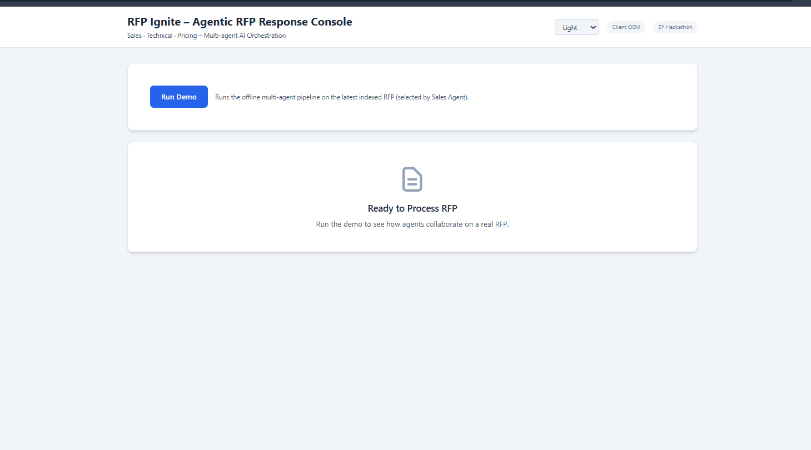
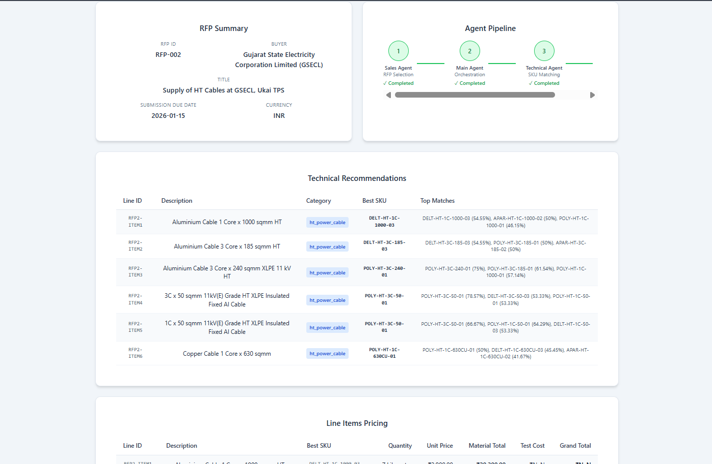
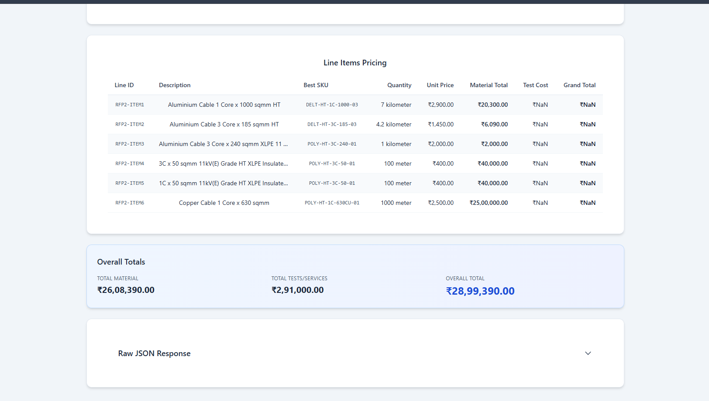
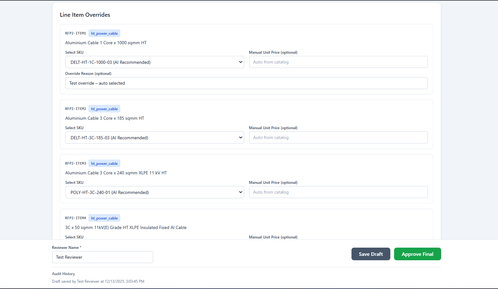
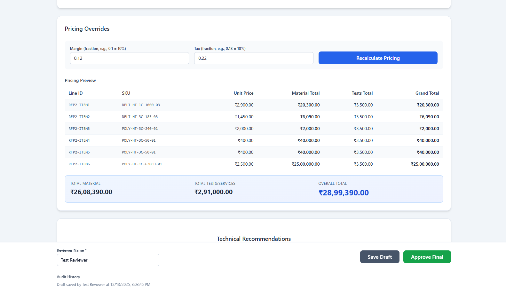

# RFP Ignite – Agentic RFP Response System

[](LICENSE)
[](https://github.com/Parth-Gochhwal/RFP-IGNITE)


---

A governed, human-in-the-loop agentic system for enterprise RFP analysis, technical validation, and pricing transparency.

## Executive Summary

Responding to enterprise RFPs is a high-effort, high-risk, and low-visibility process. Teams spend weeks coordinating across sales, engineering, and pricing functions—often redoing work, interpreting ambiguous specifications, and committing to pricing without sufficient technical validation. At scale, this leads to missed deadlines, inconsistent quality, and avoidable commercial risk.

**RFP Ignite** is an agentic RFP response system that structures this workflow into a governed, auditable pipeline. Instead of replacing human judgment, the system orchestrates specialized internal agents—Sales, Technical, and Pricing—under a central coordinator, with mandatory human approval checkpoints before any commercial commitment.

The result is a faster, more transparent, and more reliable RFP response process that preserves accountability while eliminating repetitive effort.

### Demonstrated Outcomes

- Significant reduction in initial RFP analysis and drafting time
- Early detection of specification gaps before pricing decisions
- Clear audit trail for every recommendation and override
- Scalable process without linear increase in human effort

---

## Problem Statement

### Enterprise RFP Challenges

#### Operational inefficiency
- Manual extraction of requirements from unstructured documents
- Repeated coordination across siloed teams
- No systematic reuse of prior RFP intelligence

#### Decision risk
- Pricing based on incomplete or ambiguous specifications
- Inconsistent technical interpretations
- Late discovery of compliance gaps

#### Lack of traceability
- No clear explanation for how prices or technical choices were derived
- Difficult to audit decisions after submission
- Limited accountability across stakeholders

#### Scalability constraints
- Senior reviewers become bottlenecks
- Teams decline viable RFPs due to capacity limits

---

## Solution Overview

RFP Ignite introduces a structured, agent-driven workflow with explicit governance.

### Core Design Principles

- Specialized agents, not monolithic automation
- Validation before commitment (specifications approved before pricing)
- Human-in-the-loop at critical decision points
- Auditability by default

The system is designed to augment enterprise decision-making, not replace human accountability.

---

## System Architecture (High-Level)


```
Web UI (React)
    │
    ▼
FastAPI Backend
    │
    ▼
Main Agent (Orchestrator)
    ├── Sales Agent
    ├── Technical Agent
    ├── Pricing Agent
    └── Specification Robustness Engine
            │
            ▼
        Human Review & Approval
            │
            ▼
      Final Response & Export
```

---

## Agent Responsibilities

### Main Agent (Orchestrator)
- Initiates and tracks each RFP pipeline run
- Coordinates execution order of agents
- Maintains pipeline state and run identifiers
- Aggregates outputs into a final response

### Sales Agent
- Selects and indexes relevant RFPs
- Extracts high-level commercial context
- Initiates pipeline execution

### Technical Agent
- Interprets technical requirements line-by-line
- Matches specifications against internal product catalog
- Flags ambiguities and risks
- Produces confidence-scored technical recommendations

### Pricing Agent
- Calculates costs based on validated technical outputs
- Applies pricing logic and configurable margins
- Produces line-item and aggregate cost breakdowns

### Specification Robustness Engine
- Validates completeness and clarity of specifications
- Scores reliability and risk before pricing
- Prevents downstream decisions on weak inputs

### Human Review Layer
- Mandatory approval before final submission
- Ability to override technical and pricing recommendations
- All overrides logged for audit purposes

---

## Audit & Traceability

Every RFP run generates a unique pipeline run ID.  
All actions are logged with timestamps and contextual metadata.

### Captured events include:
- Agent execution steps
- Specification validation results
- Pricing calculations
- Human overrides and approvals

Audit data is stored as structured JSON and included in export artifacts.

---

## User Interface Overview

### Dashboard
- Trigger RFP processing
- Monitor agent pipeline progress



### Technical Recommendations
- SKU matches with confidence scores
- Traceable reasoning



### Pricing Review
- Transparent cost breakdown
- Override controls with recalculation



### Review Console
- Human approval workflow
- Full audit visibility





---

## Technology Stack 

### Backend
- Python 3
- FastAPI – API layer and orchestration
- Custom agent logic (no external LLMs)
- JSON-based data stores for catalog, pricing, and audit logs

### Frontend
- React + TypeScript
- Vite
- Tailwind CSS
- Chart components for pricing and confidence visualization

### Data
- Internal product catalog (JSON)
- Pricing and testing cost tables (JSON)
- Audit logs (JSON)

> This project does **not** rely on external LLM APIs, vector databases, Docker, or cloud infrastructure.  
> All logic runs locally for demonstration and evaluation.

---

## How to Run the Demo Locally

### Prerequisites
- Python 3.10+
- Node.js 18+
- npm

### Backend
```bash
pip install -r requirements.txt
python api.py
```

Backend runs on http://localhost:8000

### Frontend
```bash
cd frontend
npm install
npm run dev
```

Frontend runs on http://localhost:3000

### Demo Flow

Open the UI
- Trigger the RFP pipeline
- Review technical recommendations
- Adjust pricing if required
- Approve final response
- Download export bundle (JSON, CSV, summary, audit log)

## Project Structure
```
## Project Structure

```text
RFP-IGNITE/
├── api.py
├── main.py
├── main_agent.py
├── sales_agent.py
├── technical_agent.py
├── pricing_agent.py
├── spec_robustness_engine.py
├── audit_logger.py
│
├── review/
│   ├── router.py
│   ├── export.py
│   ├── models.py
│   └── store.py
│
├── frontend/
│   └── src/
│
├── docs/
│   └── screenshots/
│       ├── dashboard.png
│       ├── agent-pipeline.png
│       ├── pricing-review.png
│       ├── review-console.png
│       ├── review-console2.png
│       └── review-console3.png
│
├── data/
│   ├── catalog/
│   ├── pricing/
│   ├── rfps/
│   └── audit_log.json
│
├── mock_sites/
├── scripts/
├── requirements.txt
├── package.json
├── package-lock.json
├── README.md
└── LICENSE

```

Structure reflects a clear separation between orchestration logic, domain agents, review workflows, UI, and audit artifacts.

## Scalability Perspective
While implemented as a prototype, the architecture supports:
- Parallel agent execution
- Incremental automation
- Easy extension with additional agents (e.g., Legal, Compliance)
- The design intentionally mirrors enterprise workflow patterns, not consumer automation.

## Disclaimer
This project is a proof-of-concept developed for the EY Techathon.
- Not production-hardened
- No security certification
- No regulatory guarantees
- All outputs require human validation before real-world use.

## Acknowledgments

Built for EY Techathon by Team Win.exe.

Designed for transparency. Built for governance. Ready to scale.